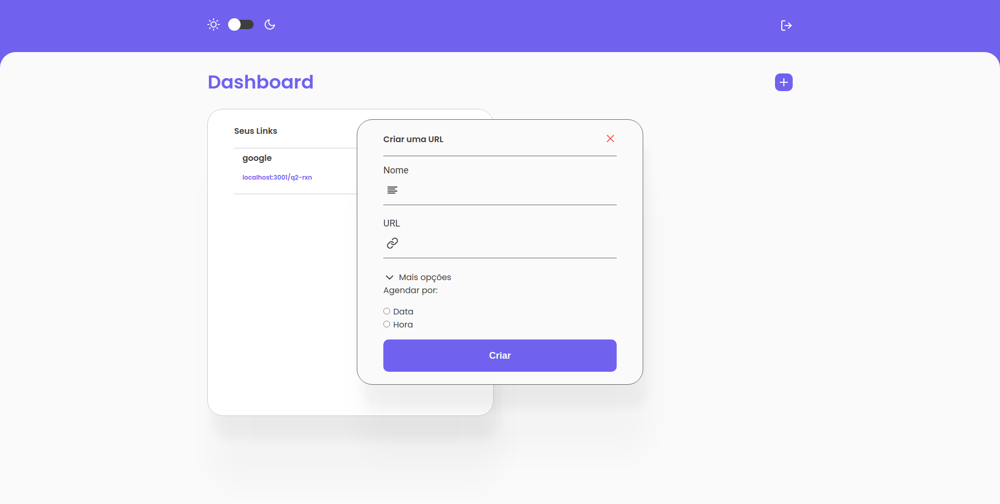
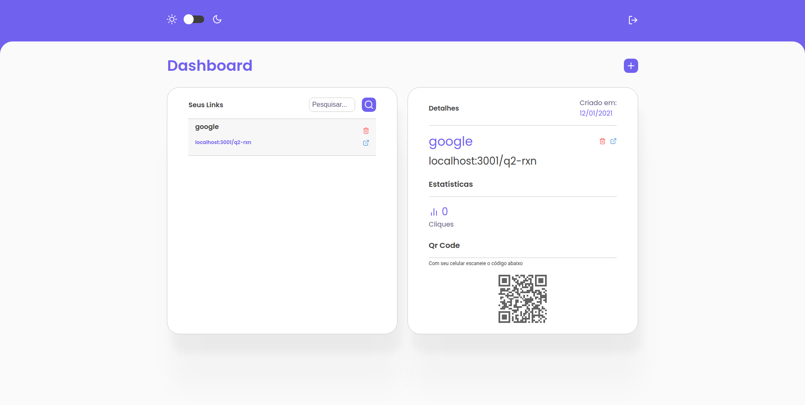
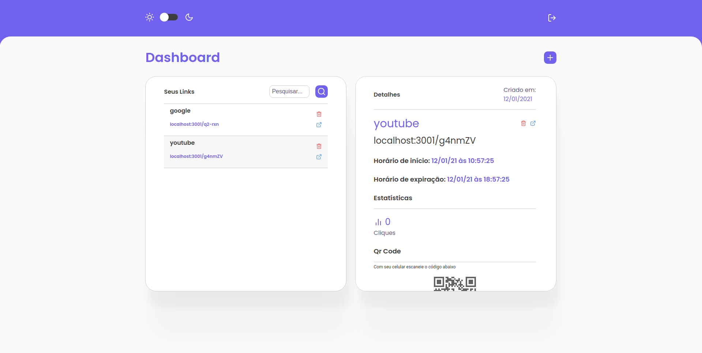
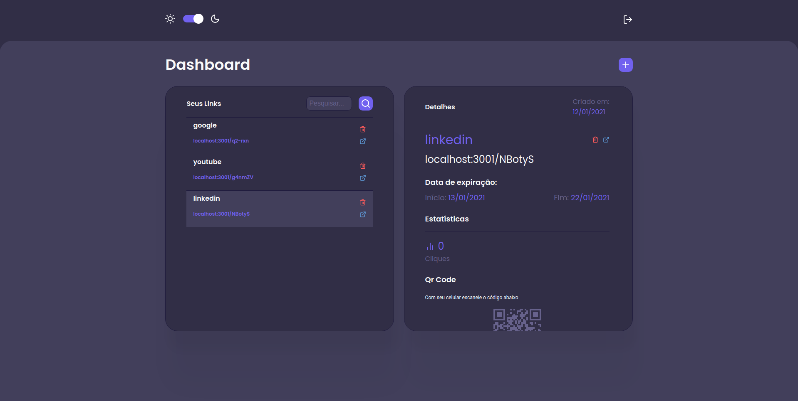

<div align="center">
  
</div>

[](https://styled-components.com/)
[](https://eslint.org/)
[](https://github.com/airbnb/javascript)
[](https://github.com/BrendoSPinheiro/shrtn-it/blob/main/LICENSE)
[](http://makeapullrequest.com)<br>

## Table of Contents
- [About](#about)
- [Web](#web)
  - [Screenshots](#screenshots)
  - [Installing](#installing)
  - [Usage](#usage)
- [API](#api)
  - [Installing](#installing-1)
  - [Configuring](#configuring)
    - [PostgreSQL](#postgresql)
      - [Migrations](#migrations)
    - [.env](#env)
  - [Usage](#usage-1)
    - [Bearer Token](#bearer-token)
    - [Routes](#routes)
    - [Requests](#requests)
- [Contributors](#contributors)

# About
This project is a URL shortener developed for my course completion project. Its main objective is to have more control over the expiration of urls and validations of broken or nonexistent urls

# Web
access the api source code here: [`WEB`](https://github.com/BrendoSPinheiro/shrtn-it/tree/main/web)

## Screenshots
 
  
 

## Installing
First clone this repository:

```shell
$ git clone https://github.com/BrendoSPinheiro/shrtn-it.git
```
second go to the server folder

```
$ cd ./web
```

third install the dependencies:

```shell
$ yarn
```
Or:

```shell
$ npm install
```
> Was installed and configured the [`eslint`](https://eslint.org/) to keep the code clean and patterned.

## Usage
To start up the app run:
```
$ yarn dev
```
Or:
```
$ npm run dev
```

# API
access the api source code here: [`API`](https://github.com/BrendoSPinheiro/shrtn-it/tree/main/server)

## Installing
First clone this repository:

```shell
$ git clone https://github.com/BrendoSPinheiro/shrtn-it.git
```
second go to the server folder

```
$ cd ./server
```

third install the dependencies:

```shell
$ yarn
```
Or:

```shell
$ npm install
```
> Was installed and configured the [`eslint`](https://eslint.org/) to keep the code clean and patterned.

## Configuring

this application uses the [PostgreSQL](https://www.postgresql.org/
) database.

### PostgreSQL
Responsible for storing the data used by the application. For the fastest configuration it is recommended to use [docker](https://www.docker.com), you can create a postgresql container like this

```
$ docker run --name pg -e POSTGRES_USER=root -e POSTGRES_PASSWORD=root -p 5432:5432 -d postgres
```

* [knexfile.js](http://knexjs.org/#knexfile)
> You can find the application's `knexfile.js` file in the root folder. It already comes with `test` and `development` connection configured, so you will update it only when deploying

#### Migrations
Remember to run the PostgreSQL database migrations:
```
$ npx knex migrate:latest
```
Or:
```
$ yarn knex migrate:latest
```
> See more information on [Knex Migrations](http://knexjs.org/#Migrations).

### .env
in this file, you will configure the jwt key.

|key|description|default
|---|---|---
|JWTSECRET|A alphanumeric random string. Used to create signed tokens.| -

## Usage
To start up the app run:
```
$ yarn dev
```
Or:
```
$ npm run dev
```

### Bearer Token
A few routes expect a Bearer Token in an `Authorization` header.
> You can see these routes in the [Routes](#routes) section.

```
POST http://localhost:3001/urls Authorization: Bearer <token>
```
To achieve this token you just need authenticate through the `/sessions` route and it will return the `token` key with a valid Bearer Token.

### Routes

|route|HTTP Method|params|description|auth method
|:---|:---:|:---:|:---:|:---:
|`/urls`|GET|:x:|Lists urls.|Bearer
|`/urls/:id`|GET|`:id` of the URL.|Get url details.|Bearer
|`/:slug`|GET|`:slug` of the short url.|Redirect short url.|:x:
|`/urls`|POST|Body with new short url data.|Create a new short url.|Bearer
|`/urls/:id`|DELETE|`:id` of the URL.|Delete short url.|Bearer
|`/users`|POST|Body with new user data.|Create a new user.|:x:
|`/session`|POST|Body with user data.|User authentication.|:x:
> Routes with `Bearer` as auth method expect an `Authorization` header. See [Bearer Token](#bearer-token) section for more information.

### Requests

* `POST /urls`

Request body:
```json
// to shorten an unscheduled URL
{
  "title": "Google",
  "full_url": "https://google.com"
}

// to shorten a URL with scheduling by date
{
  "title": "Google",
  "full_url": "https://google.com",
  "scheduling_type": "date",
  "start_expires_date": "2021-01-20",
  "end_expires_date": "2021-01-22"
}

// to shorten a URL with scheduling by hour
{
  "title": "Google",
  "full_url": "https://google.com",
  "scheduling_type": "hour",
  "start_hour": 0,
  "end_hour": 2
}
```

* `POST /users`

```json
{
  "name": "Fulano",
  "email": "fulano@mail.com",
  "password": "123456"
}
```

* `POST /session`

```json
{
  "email": "fulano@mail.com",
  "password": "123456"
}
```

# Contributors
<table>
  <tr>
    <td align="center">
      <a href="https://github.com/BrendoSPinheiro">
        <br />
        <sub><b>Brendo Souza</b></sub><br />
        <sub><b>Backend</b></sub>
      </a><br />
    </td>
    <td align="center">
      <a href="https://github.com/Matheus0liveira">
        <br />
        <sub><b>Matheus Oliveira</b></sub><br />
        <sub><b>Frontend</b></sub>
      </a><br />
    </td>
    <td align="center">
      <a href="https://github.com/EmmanoellPasquet">
        <br />
        <sub><b>Emmanoell Pasquet</b></sub><br />
        <sub><b>Author of the article</b></sub>
      </a><br />
    </td>
  </tr>
</table>