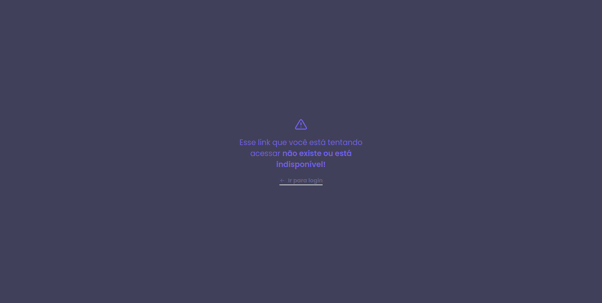

  

 

## Table of Contents
* [About](#about)
* [Screenshots](#screenshots)
* [Installing](#installing)
  * [Configuring](#configuring)
    * [.env](#env)
    * [API](#api)
* [Usage](#usage)
  * [Reactotron](#reactotron)
  * [Register & Login](#register--login)
  * [localStorage](#localstorage)
* [Running the tests](#running-the-tests)
  * [Coverage Report](#coverage-report)

## About
This project is a URL shortener developed for my TCC. Its main objective is to have more control over the expiration of urls and validations of broken or nonexistent urls

## Screenshots

